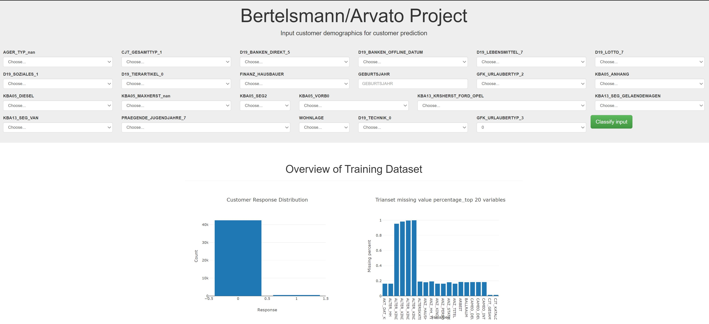
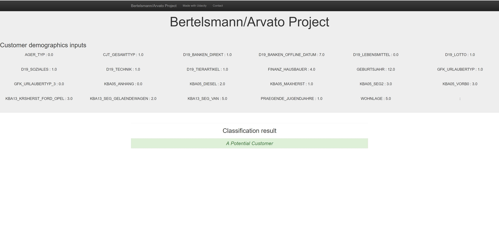

# Bertelsmann/Arvato Project

### Table of content
1. Introduction
2. Description
3. Web App
4. Installation
5. Acknowledgement

## Introduction

In this project, we will analyze demographics data for customers of a mail-order sales company in Germany, comparing it against demographics information for the general population.
We'll use unsupervised learning techniques to perform customer segmentation, identifying the parts of the population that best describe the core customer base of the company. 
Then, we'll apply what we've learned on a third dataset with demographics information for targets of a marketing campaign for the company, and use a model to predict which 
individuals are most likely to convert into becoming customers for the company. The data used has been provided by our partners at Bertelsmann Arvato Analytics, and represents 
a real-life data science task.

## Description
### Data
* DIAS Attributes Values 2017.xlsx and DIAS Information Levels Attributes 2017.xlsx are metadata file for all datasets used in this project
* Udacity_MAILOUT_052018_TRAIN.csv and Udacity_MAILOUT_052018_TEST.csv are training and testing sets for building supervised ML. Test set is the testing set on Kaggle for ML score
* variables known.csv, unknowns_0.csv, unknowns_-1.csv and unknowns_9.csv are metadata file summary files, used for data cleasing

### Project structure
1. Data explorartory
2. Customer Segmentation
  1 Data pre-processing
  2 Dimensionality reduction
  3 Clustering
3. Build supervised ML
4. Kaggle submission 

## Web Application
A web application is built to predict company's potential customer with our trained supervised ML. Python library flask is used for back end work and bootstrap library
is used for front end work. The trained model takes 24 individual demographics inputs as model attributes, as these 24 demographics info are the most weighted features evaluated by
our model. Then outputs whether or not this person is a potential customer for the company.

Home page showing response distribution and train set missing values. Input demographics of the customer you'd like to predict


Output prediction result
\

## Installation
1. Create virtual environment with command ```py -m venv enviro_name```, activate virtual environment  ```enviro_name\scripts\activate.bat```
2. Download requirements.txt and install all libraries required to run this web application on local server with command ```pip install -r requirements.txt```
3. Download data and templates folders and app.py.
4. Run the following command in the directory where app.py is in to run your web app.`python app.py`
5. Then go to  http://127.0.0.1:3001/

## Acknowledgement 
Thanks to Udacity and Bertelsmann/Arvato for providing this fun and challenging project!


